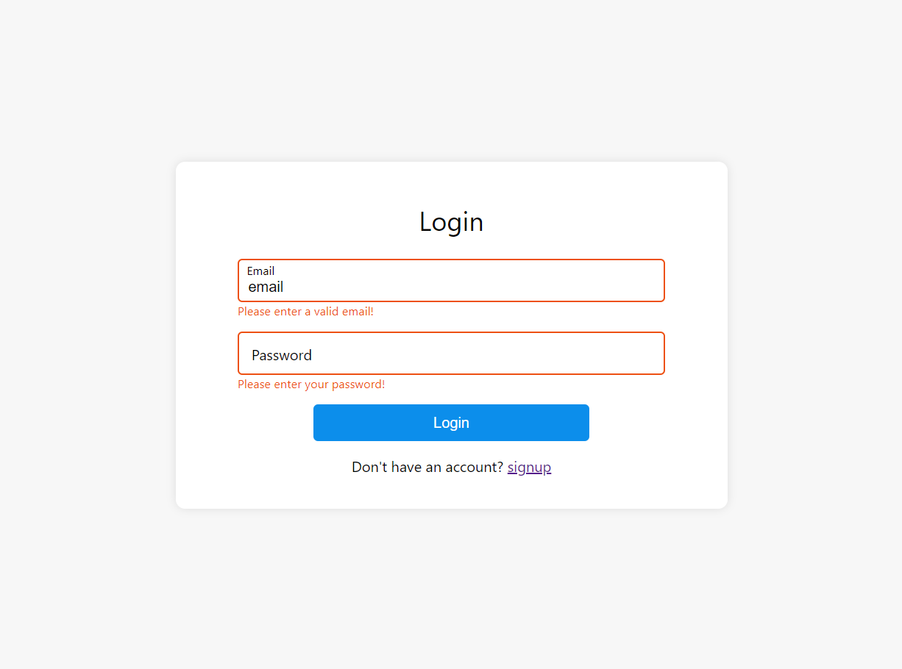
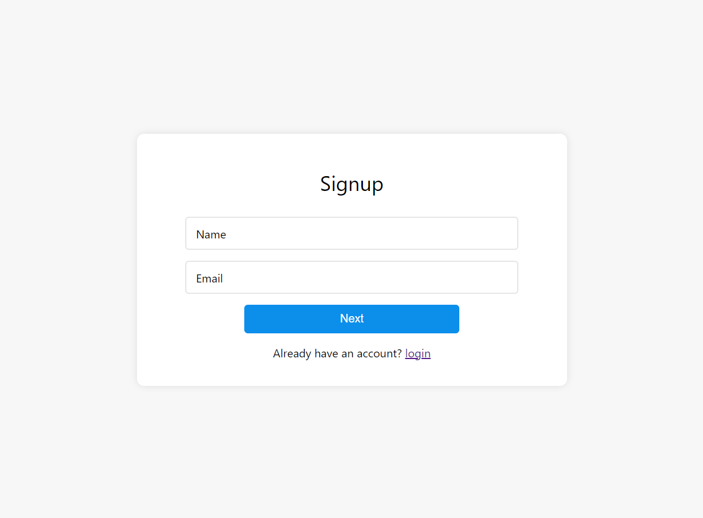
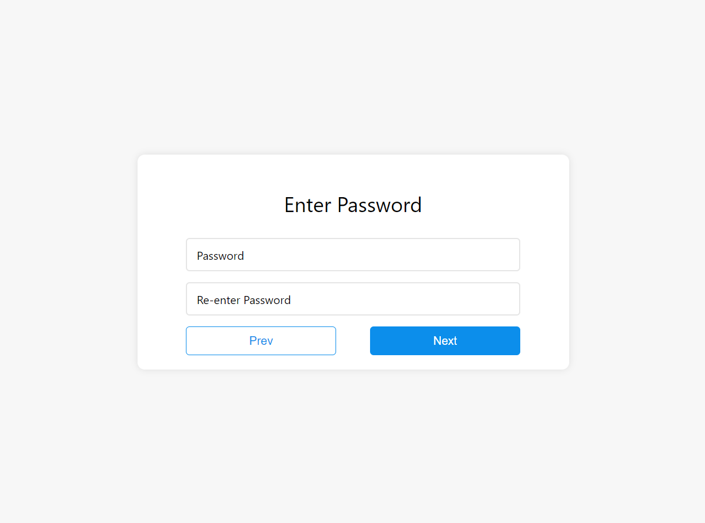
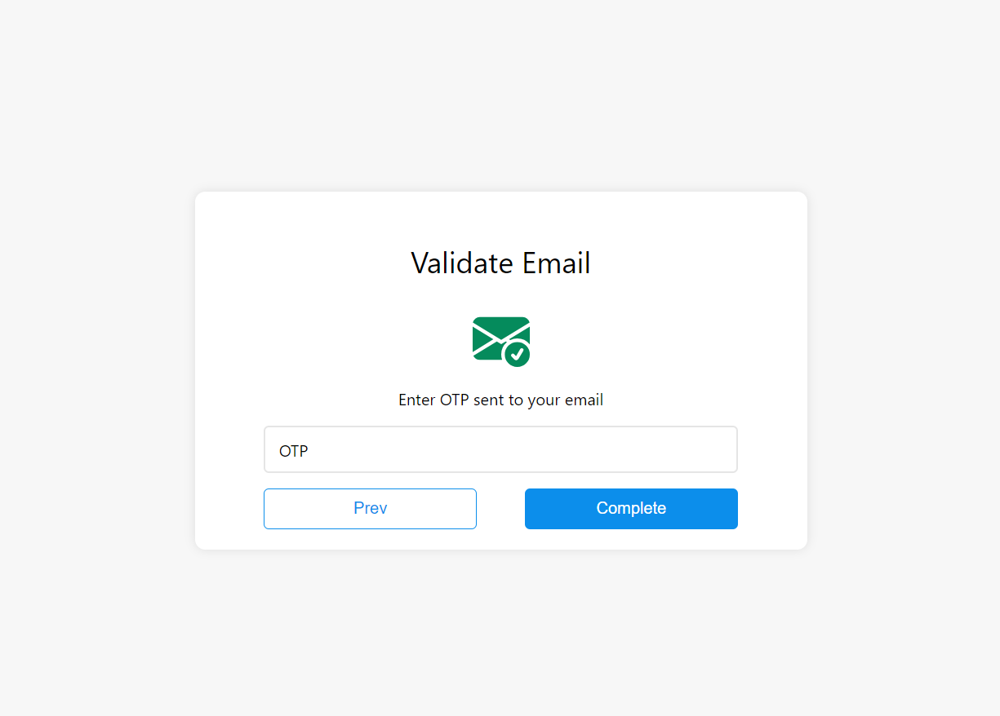

# User Authentication System

This is a full-stack web application for authenticating user while logging in and signing up.

### Table of content

 - [Introduction](#introduction)
 - [Demo Shots](#demo-short)
 - [Installation](#installation-and-usage)
 - [Features](#features)
 - [Technologies Used](#technologies-used)

 #### Introduction
 
 The app is built to make user authentication more friendly and has better gui. It overrides the browsers default validation for form and adds custom validation for errors in input field. Singup is implemented in 3 steps. Users basic info name and email, then password and lastly it sends OTP to the specified email and validates it to complete registration.
 This app is built with flask and it usages the javascript to handle the switching of different tabs in signup page. Async JavaScript is used to hadle the server side validation and rest of the validation is implemented in pure javascript.

 #### Demo Shorts

 The login page is showing the custom errors while input fields are invalid.

   
   
   
   

#### Installation And Usage

1. Install requirements: `pip install -r requirements.txt`
2. Add your secret key, email and password to `.env`file
3. Run application:  `python3 app.py`

#### Features

1. It validates the input fields
2. It checks the server for existing users
3. It users hashing to stores users password
4. Singup is handled in 3 steps

#### Technology used

Following technologies are used to build this application

`HTML`, `CSS`, `JavaScript`, `Flask`, `sqlite3`

